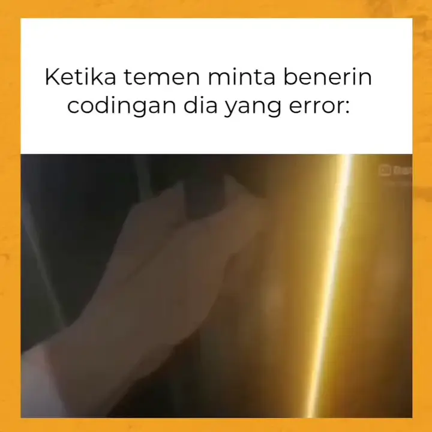

# 🐍 Tugas Algoritma dan Pemrograman - Python

<div style="display: flex; align-items: center; gap: 12px;">
  
  <div>
    <strong>Nama:</strong> Sholahuddin Ahmad<br>
    <strong>NPM:</strong> 2505060070
  </div>
</div>

---

Welcome... di repository tugas mata kuliah **Algoritma dan Pemrograman**.  

---

<p align="center">
  
</p>

---

## ⚙️ Cara Menjalankan
Pastikan kamu sudah menginstall **Python 3.x** di perangkatmu. Juga pastikan tidak menggunakan bash ketika menjalankan di visual studio code.

```
python nama_file.py
```